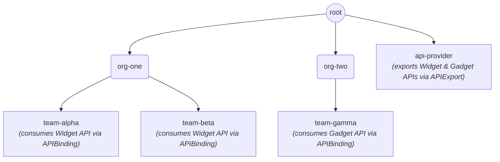
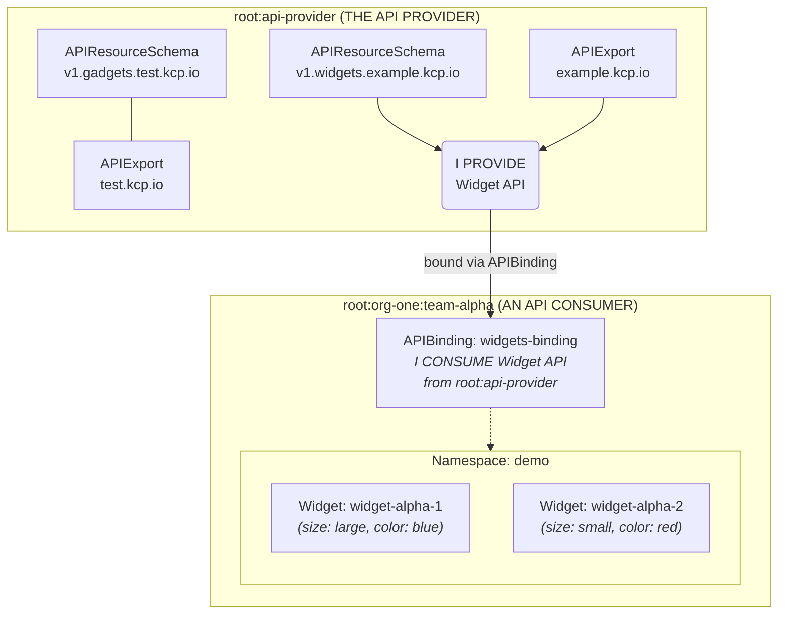
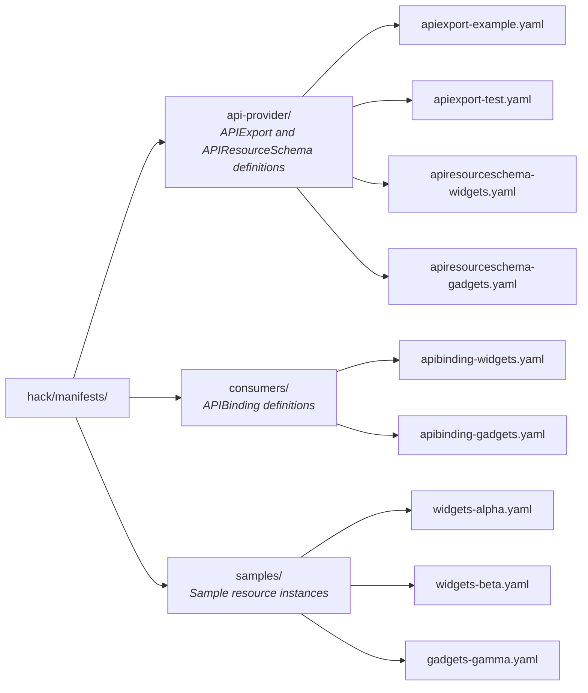
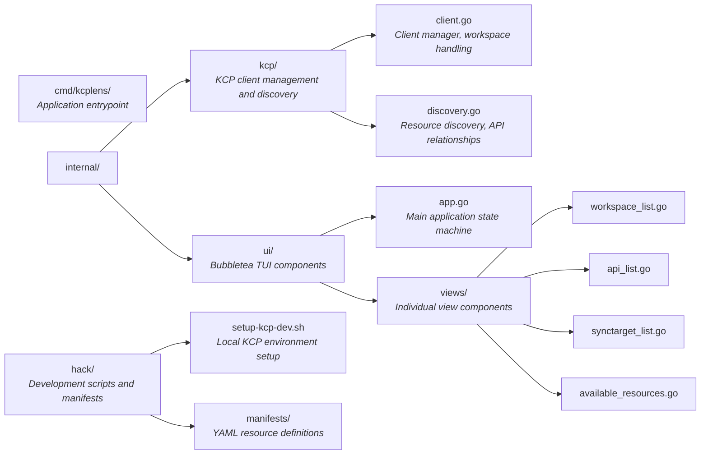

# kcplens

A terminal UI for visualizing and navigating KCP-enabled Kubernetes clusters.

## Overview

`kcplens` provides an intuitive interface for exploring KCP's multi-tenant workspaces, API inheritance (Exports/Bindings), and multi-cluster deployment targets. It makes KCP-specific concepts as easy to navigate as standard Kubernetes resources.

### Features

- **Workspace Explorer**: Navigate KCP's hierarchical workspace structure (root → orgs → teams)
- **API Relationships**: View APIExports and APIBindings with detailed info and YAML inspection
- **Resource Browser**: Discover and list all available resources in a workspace (like `kubectl get widgets`)
- **SyncTarget View**: See attached physical clusters and their status
- **Keyboard-Driven**: Full keyboard navigation with discoverable key bindings

## Installation

### Prerequisites

- Go 1.21+
- A KCP server or kubeconfig pointing to one

### Build

```shell
go build -o kcplens ./cmd/kcplens
```

## Usage

### Connect to an Existing KCP

```shell
# Use default kubeconfig (~/.kube/config)
./kcplens

# Specify a kubeconfig file
./kcplens -kubeconfig /path/to/kubeconfig
```

### Key Bindings

| Key | Action |
|-----|--------|
| `a` | View API relationships (APIExports/APIBindings) for current workspace |
| `s` | View SyncTargets (physical clusters) for current workspace |
| `r` | Browse available resources and list instances (like `kubectl get widgets`) |
| `y` | Show YAML of selected API relationship |
| `enter` | Navigate into selected workspace / list selected resource type |
| `backspace` / `esc` | Go back / return to previous view |
| `q` / `ctrl+c` | Quit |

### Navigation

The TUI uses vim-style navigation:
- `j` / `k` or arrow keys to move up/down
- `/` to filter/search the current list
- `enter` to select

You need to first navigate through the available workspaces and press `enter` to select a workspace. Then you can use the other keys to navigate through the available resources and list instances.

## Local Development Environment

A complete KCP test environment can be set up locally using the provided script.

### Quick Start

```shell
./hack/setup-kcp-dev.sh
```

This will:
1. Download KCP v0.30.0
2. Start KCP locally on `127.0.0.1`
3. Create a workspace hierarchy with API providers and consumers
4. Create sample APIExports, APIBindings, and resources

### Workspace Structure Created



## Understanding KCP's API Model

KCP separates **API providers** from **API consumers**. This is a key concept that differs from standard Kubernetes.

### The Three Resources

| Resource | Purpose | Lives In |
|----------|---------|----------|
| **APIResourceSchema** | Defines the CRD structure (fields, validation) | API provider workspace |
| **APIExport** | Exposes an API for other workspaces to consume | API provider workspace |
| **APIBinding** | Binds a workspace to an APIExport from another workspace | API consumer workspace |

### Visual Model



### Exploring the Setup

After running `./hack/setup-kcp-dev.sh`, try these commands:

```shell
export KUBECONFIG=/path/to/kcplens/.kcp-dev/admin.kubeconfig

# ═══════════════════════════════════════════════════════════════
# THE API PROVIDER WORKSPACE
# ═══════════════════════════════════════════════════════════════
kubectl ws :root:api-provider

# See what APIs are being exported
kubectl get apiexports
# NAME               AGE
# example.kcp.io     5m
# test.kcp.io        5m

# See the underlying schemas (CRD definitions)
kubectl get apiresourceschemas
# NAME                            AGE
# v1.gadgets.test.kcp.io          5m
# v1.widgets.example.kcp.io       5m

# ═══════════════════════════════════════════════════════════════
# THE API CONSUMER WORKSPACE
# ═══════════════════════════════════════════════════════════════
kubectl ws :root:org-one:team-alpha

# See the binding that brings Widget API here
kubectl get apibindings
# NAME                AGE   READY
# widgets-binding     5m    True

# ❌ WRONG: Widgets are NOT in 'default' namespace!
kubectl get widgets
# No resources found in default namespace.

# ✅ CORRECT: Widgets are in 'demo' namespace
kubectl get widgets -n demo
# NAME             SIZE    COLOR   AGE
# widget-alpha-1   large   blue    5m
# widget-alpha-2   small   red     5m

# Or see all widgets across namespaces
kubectl get widgets -A
```

### Common Gotcha

Resources created by the setup script are in the `demo` (or `test`) namespace, not `default`. Always use `-n demo` or `-A`:

```shell
# In team-alpha or team-beta
kubectl get widgets -n demo

# In team-gamma
kubectl get gadgets -n test
```

### Sample APIs

- **example.kcp.io**: Widget CRD with `size`, `color`, `replicas` fields
- **test.kcp.io**: Gadget CRD with `enabled`, `mode` fields

### Script Commands

| Command | Description |
|---------|-------------|
| `./hack/setup-kcp-dev.sh start` | Start KCP and create test resources (default) |
| `./hack/setup-kcp-dev.sh stop` | Stop KCP server |
| `./hack/setup-kcp-dev.sh clean` | Stop KCP and remove all data |
| `./hack/setup-kcp-dev.sh status` | Check if KCP is running |

### Connecting kcplens to Local KCP

```shell
# Start the dev environment
./hack/setup-kcp-dev.sh

# Connect kcplens
./kcplens -kubeconfig .kcp-dev/admin.kubeconfig
```

### Manifests

All KCP resources are stored as YAML files in `hack/manifests/`:



## Architecture



## Further Reading

- [KCP Documentation](https://docs.kcp.io/kcp/v0.30/)
- [KCP Workspaces Guide](https://docs.kcp.io/kcp/v0.30/concepts/workspaces/)
- [KCP APIs Guide](https://docs.kcp.io/kcp/v0.30/concepts/apis/)
- [KCP SyncTargets](https://docs.kcp.io/kcp/v0.30/concepts/synctargets/)

## License

MIT
